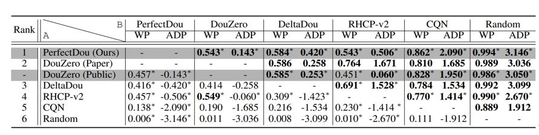

# [NeurIPS 2022] PerfectDou: Dominating DouDizhu with Perfect Information Distillation
The official repo for the NeurIPS 2022 paper <PerfectDou: Dominating DouDizhu with Perfect Information Distillation>.

**Note: We only realease our pretrained model and the evaluation code. The training code is currently unavailable since a distributed system was used. The codes for calculating left hands and for feature engineering are provided as shared library (i.e., *.so file), the details of these two modules could be found in the paper. We will inform you at the first time once we decide to open source these codes.**

## An online demo to play with! Have fun!
* Online Demo: [https://outer-perfectdou-demo-gzailab.nie.netease.com](https://outer-perfectdou-demo-gzailab.nie.netease.com)

## About PerfectDou

PerfectDou is current the state-of-the-art DouDizhu AI system for the game of [DouDizhu](https://en.wikipedia.org/wiki/Dou_dizhu) ([斗地主](https://baike.baidu.com/item/%E6%96%97%E5%9C%B0%E4%B8%BB/177997)) developed by **Netease Games AI Lab**, with **Shanghai Jiao Tong University** and **Carnegie Mellon University**. 

The proposed technique named perfect information distillation (a perfect-training-imperfect-execution framework) allows the agents to utilize the global information to guide the training of the policies as if it is a perfect information game and the trained policies can be used to play the imperfect information game during the actual gameplay.  

  

For more details, please check our [paper](https://arxiv.org/abs/2203.16406), where we show how and why PerfectDou beats all existing AI programs, and achieves state-of-the-art performance.

*   Paper: [https://arxiv.org/abs/2203.16406](https://arxiv.org/abs/2203.16406) 


## Cite this Work

```bibtex
@inproceedings{yang2022perfectdou,
  title={PerfectDou: Dominating DouDizhu with Perfect Information Distillation},
  author={Yang, Guan and Liu, Minghuan and Hong, Weijun and Zhang, Weinan and Fang, Fei and Zeng, Guangjun and Lin, Yue},
  booktitle={NeurIPS},
  year={2022}
}
```

## Evaluation Pipeline
The pre-trained model is provided in `perfectdou/model/`. For the convenience of comparison, the game environment and evaluation methods are the same as those in [DouZero](https://github.com/kwai/DouZero/tree/main/douzero/evaluation).
  
Some pre-trained models and heuristics as baselines have also been provided:
*   [random](douzero/evaluation/random_agent.py): agents that play randomly (uniformly)
*   [rlcard](douzero/evaluation/rlcard_agent.py): the rule-based agent in [RLCard](https://github.com/datamllab/rlcard)
*   [DouZero](https://github.com/kwai/DouZero): the ADP (Average Difference Points) version
*  PerfectDou: the 2.5e9 frames version in the paper

### Step 0: Ready for Prerequisite

First, clone the repo 
```
git clone https://github.com/Netease-Games-AI-Lab-Guangzhou/PerfectDou.git
```
Make sure you have python 3.7 installed and then install dependencies:
```
cd PerfectDou
pip3 install -r requirements.txt
```

### Step 1: Generate evaluation data
```
python3 generate_eval_data.py
```
Some important hyperparameters are as follows:
*   `--output`: where the pickled data will be saved
*   `--num_games`: how many random games will be generated, default 10000

### Step 2: Self-Play
```
python3 evaluate.py
```
Some important hyperparameters are as follows:
*   `--landlord`: which agent will play as Landlord, which can be random, rlcard, douzero, perfectdou, or the path of the pre-trained model
*   `--landlord_up`: which agent will play as LandlordUp (the one plays before the Landlord), which can be random, rlcard, douzero, perfectdou, or the path of the pre-trained model
*   `--landlord_down`: which agent will play as LandlordDown (the one plays after the Landlord), which can be random, rlcard, douzero, perfectdou, or the path of the pre-trained model
*   `--eval_data`: the pickle file that contains evaluation data
*   `--num_workers`: how many subprocesses will be used

For example, the following command evaluates PerfectDou in Landlord position against DouZero agents
```
python3 evaluate.py --landlord perfectdou --landlord_up douzero --landlord_down douzero
```

## Acknowlegements
*   The demo is mainly based on [RLCard-Showdown](https://github.com/datamllab/rlcard-showdown)
*   Evaluation code and game environment implementation is mainly based on [DouZero](https://github.com/kwai/DouZero)

## Contact Us
Please contact us if you have any problems.
  
yangguan@corp.netease.com

minghuanliu@sjtu.edu.cn
  
hongweijun@corp.netease.com

gzzengguangjun@corp.netease.com


